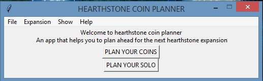

# Hearthstone-Coins-Planner

[](https://www.python.org/) [](http://perso.crans.org/besson/LICENSE.html)


# Table of contents

<!--ts-->
  * [Hearthstone-Coins-Planner](#Hearthstone-Coins-Planner)
  * [Table of contents](#Table_of_contents)
  * [Files/Folders](#Files/Folders)
  * [Dependencies](#Dependencies)
  * [Current Version](#Current_Version)
  * [Documentation](#Documentation)
  * [Radon](#Radon)
    * [Radon_cc](#Radon_cc)
    * [Radon_hal](#Radon_hal)
    * [Radon_mi](#Radon_mi)
    * [Radon_raw](#Radon_raw)
  * [Keybinds](#Keybinds)
  * [What's New](#What's_New)
  * [License](#License)
<!--te-->

# Files/Folders

<ul>
 <li> doc (documentation folder) </li>
 <li> images (images folder) </li> 
 <li> Hearthstone_coin_planner_keybinds.txt (keybinds file) </li>
 <li> hearthstone coin planner.py(the main file) </li>
 <li> planning.csv(.csv file created by the main file) </li>
</ul>

# Dependencies

To install the dependencies

 <ul>
  <li> csv (conda install -c anaconda csvkit) </li>
  <li> second way to install csv ( pip install python-csv) </li>
  <li> pandas (conda install -c anaconda pandas) </li>
  <li> second way to install pandas ( pip install pandas) </li>
</ul>

```shell
pip install -r requirements.txt
```

# Current_Version

<p> </p>

# Documentation

All project documentation is located in the `./doc`  folder.

# Radon

## Radon_cc

<p> </p>

## Radon_hal

<p> </p>

## Radon_mi

<p> </p>

## Radon_raw

<p> </p>

# Keybinds
<ul>
 <li> Plan your coins (Ctrl + P)</li>
 <li> Exit (Alt + F4) </li>
 <li> Release Date (Ctrl + R) </li>
 <li> Days from today (Ctrl + D) </li>
 <li> Show Plans (Alt + P) </li>
 <li> Help (Ctrl + F1) </li>
 <li> About (Ctrl + I) </li>
</ul>
  

# What's_New
**Now you can also plan for the solo too**


# License
[GNU GPLv3](https://choosealicense.com/licenses/gpl-3.0/)
