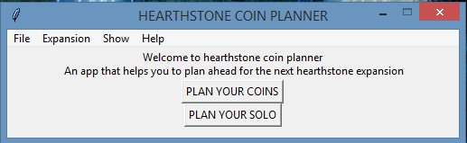

# Hearthstone-Coins-Planner

## YOU PLAY HEARTHSTONE ?

## YOU ARE PREPARING FOR THE NEXT EXPANSION?

## YOU NEED TO KNOW THE DAYS YOU NEED TO PLAY TO OPEN 100 PACKS?

## YOU NEED TO USE Hearthstone Coins Planner

## Dependencies

 <ul>
  <li> csv (conda install -c anaconda csvkit) </li>
  <li> second way to install csv ( pip install python-csv) </li>
  <li> pandas (conda install -c anaconda pandas) </li>
  <li> second way to install pandas ( pip install pandas) </li>
</ul>

## FILES

<ul>
 <li> hearthstone coin planner.py(the main file) </li>
 <li> planning.csv(.csv file created by the main file) </li>
</ul>
 
## HOW TO USE
<ul>
  <li> press the button PLAN YOUR COINS/PLAN YOUR SOLO</li>
  <li> answer the pop up questions </li>
  <li> A pop up window will give you the answer you want </li>
</ul>

**Current Version**

 

## Key binds
<ul>
 <li> Plan your coins (Ctrl + P)</li>
 <li> Exit (Alt + F4) </li>
 <li> Release Date (Ctrl + R) </li>
 <li> Days from today (Ctrl + D) </li>
 <li> Show Plans (Alt + P) </li>
 <li> Help (Ctrl + F1) </li>
 <li> About (Ctrl + I) </li>
</ul>
  

# What's New
**Now you can also plan for the solo too**
